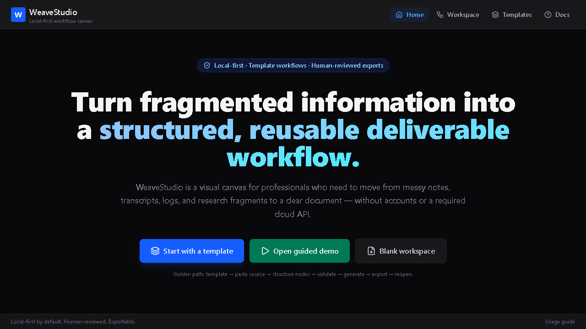
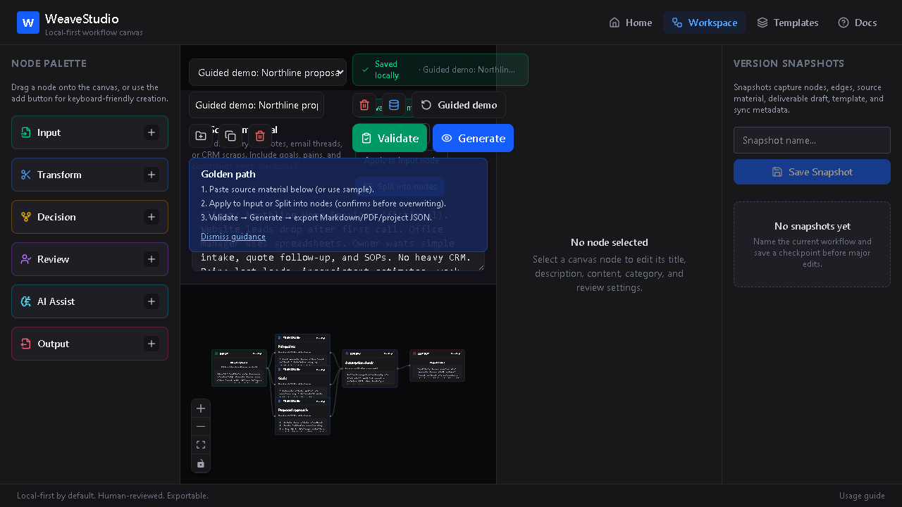
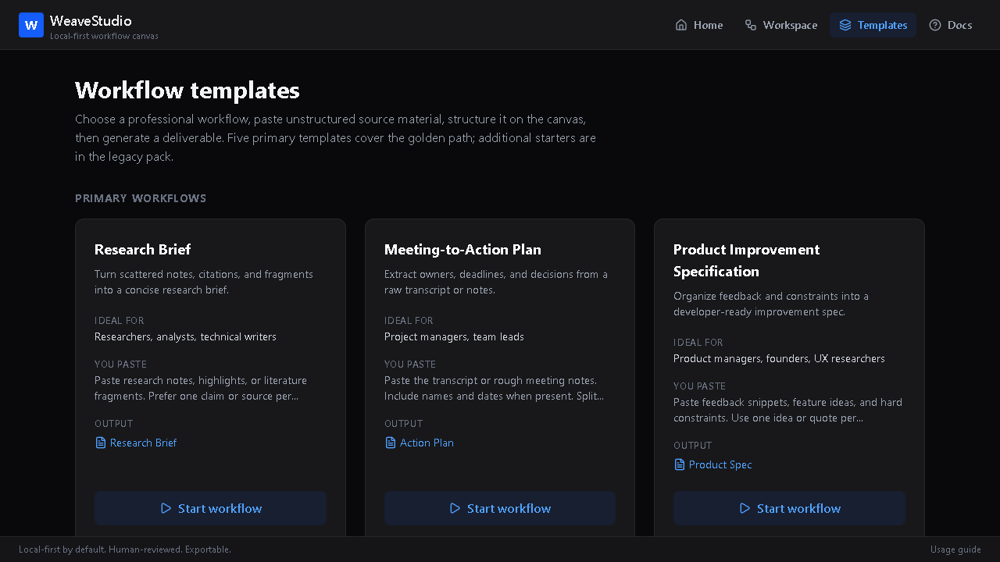
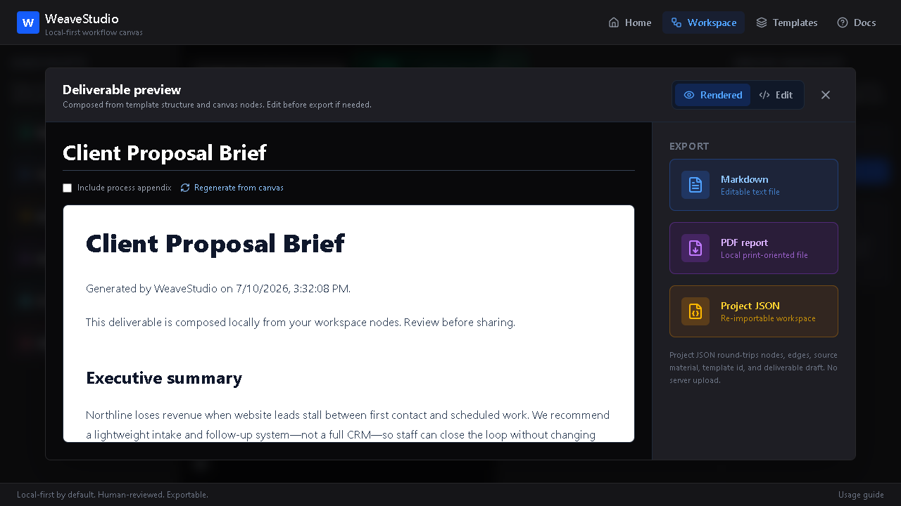

# WeaveStudio

**Turn fragmented information into a structured, reusable deliverable workflow.**

WeaveStudio is a local-first visual workflow canvas for turning messy notes, transcripts, logs, research fragments, and discovery inputs into reviewable, reusable deliverables.

[Open the live production application](https://weavestudio-nine.vercel.app/)

**Release status:** v1.0.0



## The problem it solves

Important source material often begins as scattered, inconsistent fragments. WeaveStudio gives that material a visible workflow shape: source content becomes editable nodes, nodes become a structured deliverable, and the final result remains reviewable before it is shared.

## Golden path

1. Choose a professional workflow template or open the guided demo.
2. Paste unstructured source material.
3. Apply the source to an Input node or split it into editable nodes.
4. Organize, connect, classify, and review the workflow on the canvas.
5. Run Workflow Validator, then generate a template-structured deliverable.
6. Review and edit the draft before exporting Markdown, PDF, or Project JSON.
7. Reopen the named workspace later in the same browser profile.

## Implemented capabilities

- Visual workflow canvas powered by `@xyflow/react`
- Five primary templates plus an expandable legacy starter pack
- Source ingest, editable canvas nodes, and explicit review checkpoints
- Named browser-local workspaces with autosave, visible save state, and snapshots
- Workflow Validator for structure, completeness, review gaps, and export readiness
- Template-structured deliverable generation with an editable draft
- Markdown, PDF, and re-importable Project JSON export
- Optional AI Assist blueprint: offline/mock-first, with live provider requests only after explicit confirmation

## Product tour

### Guided workflow workspace



### Template gallery



### Deliverable preview and exports



## Local-first architecture

WeaveStudio is a static browser application. The standard workflow has no backend, account system, cloud database, or required external API. Workspaces are stored in browser `localStorage`; exports are files you initiate from the browser.

The normal workflow does not make provider requests. Optional AI Assist live-provider requests are disabled until a user explicitly confirms the action and may send the configured prompt/context to that provider. API keys are not bundled with WeaveStudio and are not saved to `localStorage`.

## Local development

```bash
npm ci
npm run dev
```

## Verification

```bash
npm test
npm run lint
npm run typecheck
npm run build
```

To inspect the built application locally:

```bash
npm run preview
```

## Export and persistence

- **Markdown** produces an editable text deliverable.
- **PDF** produces a simple local print-oriented representation of the draft.
- **Project JSON** preserves the workspace nodes, edges, source material, template selection, and deliverable draft for re-import.
- **Snapshots** capture a coherent local checkpoint of the workspace state.

## Known limitations and review boundaries

- Browser `localStorage` is neither encrypted storage nor durable cloud storage. Clearing site data, using private browsing, changing browsers, or device cleanup can remove workspaces.
- Workflow Validator evaluates workflow structure and readiness; it does not verify facts or guarantee correctness.
- Generated work requires human review before sharing.
- WeaveStudio is a single-user, desktop-oriented workflow tool. It does not provide real-time collaboration, cloud sync, or account-based sharing.
- It is not legal, medical, financial, compliance, or security software.

See [KNOWN_LIMITATIONS.md](KNOWN_LIMITATIONS.md) for full details.

## License

[Proprietary - All Rights Reserved](LICENSE.md). Access to this private repository does not grant a license to reuse the source or associated intellectual property.

## Production deployment

Production is deployed from the authoritative `master` branch to [weavestudio-nine.vercel.app](https://weavestudio-nine.vercel.app/). `vercel.json` provides the SPA rewrite needed for direct route refreshes.
