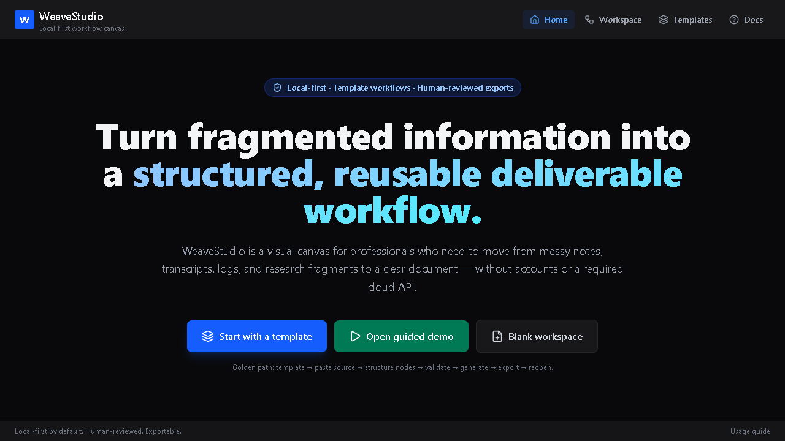
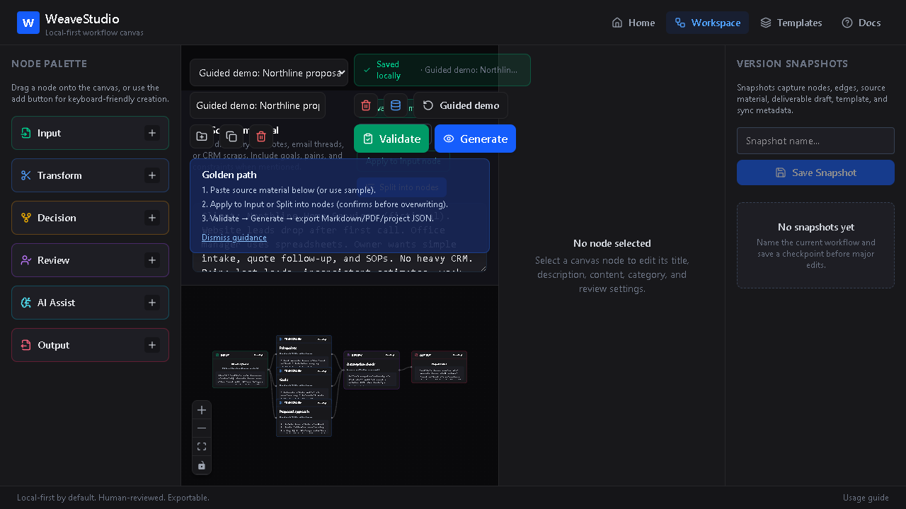
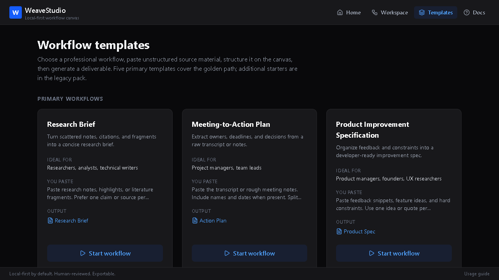
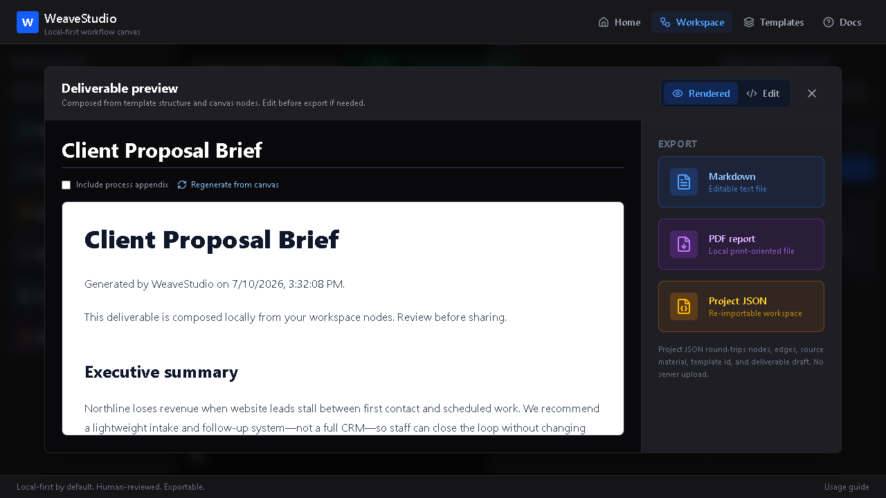

# WeaveStudio

[](https://github.com/atomicdjt/weavestudio/actions/workflows/ci.yml)

**Turn fragmented information into a structured, reusable deliverable workflow.**

**[Canonical project page](https://ai-project-portfolio-portfolio-hub.vercel.app/projects/weavestudio) · [Public demo](https://weavestudio-nine.vercel.app/) · [Full portfolio](https://ai-project-portfolio-portfolio-hub.vercel.app/)**

**License:** **Proprietary / All Rights Reserved.** Public source visibility is for evaluation, portfolio review, technical critique, and prospective collaboration or acquisition review only. This repository is **not open source**; see [LICENSE.md](LICENSE.md).

**Built by David Turner · [atomicdjt](https://github.com/atomicdjt)**

### What is this?
WeaveStudio is a local-first visual workflow canvas for turning messy notes, transcripts, logs, research fragments, and discovery inputs into reviewable, reusable deliverables.

### Who is it for?
It is designed for researchers, analysts, project managers, and consultants who need to synthesize unstructured source material into professional, structured documents without relying on cloud-based SaaS backends.

### Why is it interesting?
It features a true local-first architecture using browser `localStorage`. There is no backend, no cloud database, and no mandatory external API. Data stays in your browser unless you explicitly initiate an export or use the BYOK AI feature with explicit consent.

### Can I see it?
Yes! [Open the canonical public demo](https://weavestudio-nine.vercel.app/)

### Want to challenge it?
Yes. [Try the demo and leave candid feedback](https://github.com/atomicdjt/weavestudio/issues/21). I am specifically looking for confusing steps, missing capabilities, trust concerns, unmet expectations, and reasons you would not use it in real work.

### Where is the evidence?
The codebase includes a comprehensive [Case study](docs/CASE_STUDY.md), architectural documentation, [Known limitations](docs/KNOWN_LIMITATIONS.md), and a separate [Acquisition overview](https://weavestudio-nine.vercel.app/acquire) for buyer review.

**More by David Turner:** [BuildWorld AI](https://github.com/atomicdjt/buildworld-ai) · [Validation Ledger](https://github.com/atomicdjt/validation-ledger) · [GitHub profile](https://github.com/atomicdjt)

**Release status:** v1.0.0 — current consolidated release



## Current release authority

The authoritative editable source and production branch is `main`. The released feature set, OpenAI/Gemini BYOK workflow, browser validation, repository-governance work, buyer materials, and commercial architecture guidance were preserved from the released `master` lineage during the July 2026 non-force branch migration. `master` is retained only as a compatibility/legacy branch.

`https://weavestudio-nine.vercel.app/` is canonical production. `https://weavestudio-demo.vercel.app/` is a supporting noncanonical buyer-review and transfer surface referenced by due-diligence materials; it is not a second production authority.

Generated acquisition ZIPs and deployment artifacts are outputs of the authoritative source; they do not supersede it.

## The problem it solves

Important source material often begins as scattered, inconsistent fragments. WeaveStudio gives that material a visible workflow shape: source content becomes editable nodes, nodes become a structured deliverable, and the final result remains reviewable before it is shared.

## Golden path

1. Choose a professional workflow template or open the guided demo.
2. Paste unstructured source material.
3. Apply the source to an Input node or split it into editable nodes.
4. Organize, connect, classify, and review the workflow on the canvas.
5. Run Workflow Validator, then generate a template-structured deliverable.
6. Review and edit the draft before exporting Markdown, PDF, or Project JSON.
7. Reopen the named workspace later in the same browser profile.

## Implemented capabilities

- Visual workflow canvas powered by `@xyflow/react`
- Five primary templates plus an expandable legacy starter pack
- Source ingest, editable canvas nodes, and explicit review checkpoints
- Explicit claim-to-source provenance: selected source ranges can be linked to reviewable claims with direct, transformed, manual, or AI-assisted derivation labels
- Reviewer-facing provenance inspection in Output Preview with valid/stale/broken/missing status and exact source quotes
- Named browser-local workspaces with autosave, visible save state, and snapshots
- Bounded workspace undo/redo with toolbar and keyboard shortcuts
- Workflow outline, minimap, explicit auto-layout, and keyboard-safe deletion
- Workflow Validator for structure, completeness, review gaps, and export readiness
- Template-structured deliverable generation with an editable draft
- Markdown, PDF, and re-importable Project JSON export
- Owned-data backup, validated restore, import-as-new, scoped clearing, and storage-pressure guidance
- Optional OpenAI/Gemini BYOK assistance with explicit consent for each request and human review before applying output

## Product tour

### Guided workflow workspace



### Template gallery



### Deliverable preview and exports



## Local-first architecture

WeaveStudio is a static browser application. The standard workflow has no backend, account system, cloud database, or required external API. Workspaces are stored in browser `localStorage`; exports are files you initiate from the browser.

The normal workflow does not make provider requests. Optional AI Assist requests are disabled until a user explicitly confirms the individual action and may send the displayed prompt/context to the selected provider. API keys are not bundled with WeaveStudio, are held only in volatile tab memory, and are not saved to `localStorage` or project exports.

Provenance is also browser-local workspace metadata. It records **workspace lineage**—which captured source fragments and declared transform/AI-assist steps a claim was linked to. It does **not** prove external factual truth, source authenticity, or that the source itself is trustworthy. Provenance fingerprints are deterministic stale-reference detectors, not cryptographic authenticity proofs.

## Local development

```bash
npm ci
npm run dev
```

## Verification

```bash
npm test
npm run lint
npm run typecheck
npm run build
npm run test:browser
npm run package:acquisition
# Full buyer release gate
npm run verify:buyer
```

To inspect the built application locally:

```bash
npm run preview
```

The manually dispatched or acquisition-tag-triggered workflow in [`.github/workflows/acquisition-release.yml`](.github/workflows/acquisition-release.yml) runs the buyer gate and produces a private release artifact containing the deterministic package, package manifest, CycloneDX SBOM, release summary, and SHA-256 inventory.

## Export and persistence

- **Markdown** produces an editable text deliverable.
- **PDF** produces a simple local print-oriented representation of the draft.
- **Project JSON** preserves workspace nodes, edges, source material, template selection, deliverable draft, and provenance identifiers for validated re-import.
- **Snapshots** capture a coherent local checkpoint of workspace state, including provenance when present.
- **Download all local data** creates an owned-data backup that can be validated and restored.

## Known limitations and review boundaries

- Browser `localStorage` is neither encrypted storage nor durable cloud storage. Clearing site data, using private browsing, changing browsers, or device cleanup can remove workspaces.
- Workflow Validator evaluates workflow structure and readiness; it does not verify facts or guarantee correctness.
- Provenance records workspace lineage only. A `Valid` trace means the recorded claim, declared intermediate steps, and captured source ranges still resolve consistently; it does not establish factual truth, source authenticity, or source quality.
- Generated and AI-assisted work requires human review before sharing or applying.
- WeaveStudio is a single-user workflow tool. It does not provide real-time collaboration, cloud sync, account-based sharing, or billing.
- Dense graph editing is most efficient on desktop; mobile includes dedicated Inspector and Snapshot sheets but remains better suited to review and lighter edits.
- It is not legal, medical, financial, compliance, or security software.

See [KNOWN_LIMITATIONS.md](docs/KNOWN_LIMITATIONS.md) for full details.

## License

[Proprietary — All Rights Reserved](LICENSE.md). Public visibility is provided for evaluation and portfolio review only. It does not grant a license to copy, redistribute, commercialize, or reuse the source or associated intellectual property.

## Production deployment

Production is deployed from the authoritative `main` branch to [weavestudio-nine.vercel.app](https://weavestudio-nine.vercel.app/). The public review demo and acquisition overview are available at [weavestudio-demo.vercel.app](https://weavestudio-demo.vercel.app/). `vercel.json` provides the SPA rewrite needed for direct route refreshes.

## Buyer materials

The acquisition-ready executive summary, architecture and maintenance guide, feature-reality matrix, outreach copy, value proof, public-demo notes, and preview instructions are in [`docs/buyer/`](docs/buyer/). The package command builds a fresh ZIP and prints its SHA-256; generated release files are intentionally not committed.

Fast-sale and transaction materials:

- [One-page acquisition brief](docs/buyer/ONE_PAGE_ACQUISITION_BRIEF.md)
- [Included asset schedule](docs/buyer/ASSET_SCHEDULE.md)
- [Excluded assets and retained rights](docs/buyer/EXCLUDED_ASSETS.md)
- [Buyer due-diligence index](docs/buyer/DUE_DILIGENCE_INDEX.md)
- [Closing runbook](docs/buyer/CLOSING_RUNBOOK.md)
- [Post-close support terms](docs/buyer/POST_CLOSE_SUPPORT_TERMS.md)
- [Transfer checklist](docs/buyer/TRANSFER_CHECKLIST.md)
- [90-day buyer operating plan](docs/buyer/OPERATING_PLAN_90_DAYS.md)

Draft legal-review templates are available under [`docs/buyer/legal/`](docs/buyer/legal/). They are working templates only and are not legal advice or self-executing transaction documents.

No revenue, customer, active-user, compliance-certification, or completed-acquisition claim is included with this asset.

