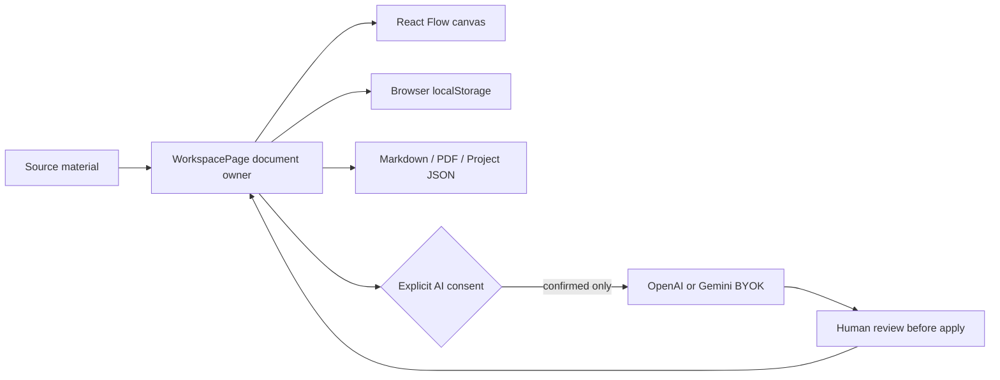

# Architecture and Maintenance

## Runtime

Static Vite/React application deployed to Vercel. `WorkspacePage` owns the active `WorkspaceDocument`; React Flow owns transient canvas interaction state. Browser `localStorage` is the sole persistence layer. No server database, account, analytics, or bundled secret is required.

## Main modules

| Area | Location | Responsibility |
|---|---|---|
| Workspace orchestration | `src/pages/WorkspacePage.tsx` | Active document, autosave, source flow, canvas callbacks, history |
| Persistence | `src/lib/workspaceStore.ts` | Validated workspace/snapshot reads and writes, imports, exports |
| History | `src/lib/workspaceHistory.ts` | Bounded in-memory undo/redo for document mutations |
| Canvas | `src/components/canvas/WorkflowCanvas.tsx` | React Flow interaction and viewport synchronization |
| Deliverables | `src/lib/deliverableEngine.ts`, `src/lib/exporter.ts` | Deterministic composition and local exports |
| Optional AI | `src/lib/ai.ts` | Normalized OpenAI/Gemini requests after explicit consent |

## Operations

`npm ci`, `npm run verify:buyer`, and `npm run package:acquisition` provide the release gate. Packaging uses the available Python runtime only to write a byte-stable ZIP; the shipped application remains a static Node/Vite build with no Python runtime requirement.

## Security and privacy posture

- Standard work remains local to the browser.
- API keys are volatile UI memory and are not project/backup/export fields.
- Live provider requests require per-request explicit consent and send only the selected prompt/context.
- Browser storage is not encrypted and should not be used as the sole copy of valuable work.
- A buyer adding accounts, cloud sync, or an owner-funded AI proxy must add authentication, authorization, rate limiting, abuse controls, retention policy, and operational monitoring.
