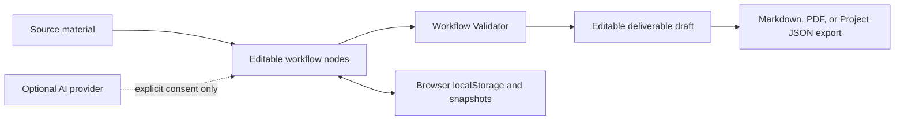

# WeaveStudio Case Study

## Executive summary

WeaveStudio is a local-first visual workflow canvas for turning fragmented notes, transcripts, logs, and research fragments into reviewable deliverables. It is a single-user browser application with optional, consent-gated AI assistance; its default path works without a provider, account, or backend.

**Technical implementation verified; external user outcome not yet validated.** It is prepared for pilot or acquisition review. Acquisition interest and transaction outcomes have not been independently established.

## Problem, user, and scope

The intended user is someone who starts with unstructured material and needs a visible, reusable workflow before sharing a deliverable. The product turns source material into editable nodes, structured sections, an editable draft, and local exports. It does not claim fact-checking, collaboration, cloud sync, compliance, or autonomous decision-making.

## Workflow and architecture

The React/Vite application uses `@xyflow/react` for the canvas, browser `localStorage` for workspaces and snapshots, and local export/import formats for portability. The optional provider path uses an explicit confirmation dialog; keys are held in volatile tab memory and are not bundled, persisted, or exported.

## Product decisions and tradeoffs

- **Local-first by default:** avoids a required account/backend but means browser storage is not encrypted or durable.
- **Human review before use:** Workflow Validator checks structure and readiness, not factual correctness.
- **Portable exports:** Markdown and Project JSON provide useful handoff; PDF is deliberately limited in typography and Unicode support.
- **Desktop-first canvas:** mobile supports inspection and lighter edits, but dense graph work is better on larger screens.
- **Consent-gated AI:** provides optional assistance without making network transfer or a provider account a default requirement.

Rejected scope is documented in `KNOWN_LIMITATIONS.md`: no real-time collaboration, cloud sync, billing, legal/compliance functionality, or hidden provider calls.

## David's role and AI assistance

David defined the workflow boundaries, product scope, local-first architecture, review checkpoints, release/package process, acceptance criteria, and verification expectations. AI assistance is a documented optional product capability and may also assist implementation work; generated output is treated as a reviewable draft, not an autonomous final result.

## Verification evidence

- `npm test`: 45 unit tests passed during the 2026-08-05 remediation baseline.
- `npm run test:browser`: 21 browser tests passed; 7 mobile-specific cases were explicitly skipped by the suite.
- Browser coverage includes guided demo, invalid-route recovery, explicit AI consent, Escape/focus return, workflow outline, acquisition route, keyboard undo/redo, canvas navigation, and corrupt-import recovery.
- `npm run lint`, `npm run typecheck`, `npm run build`, `npm run verify:buyer`, and `npm run package:acquisition` passed in the remediation baseline.
- Acquisition package validation produced a 154-file archive with SHA-256 `a89826d725f9b29a4919a94bcb72276c2889c32718e4f246949291031e172b52`.

## Deployment and acquisition model

Canonical production and acquisition review are `https://weavestudio-nine.vercel.app/` and `/acquire`. The separate `weavestudio-demo` Vercel project is a non-canonical hardening-branch preview. The canonical product is sourced from `atomicdjt/weavestudio` `main`; provider-side branch/commit provenance remains a documented approval-gated verification item.

Generated acquisition ZIPs are outputs, not source authority. Buyer materials distinguish public review material from seller-only or transaction material. No price, payment, buyer, or transaction result is asserted here.

## Accessibility, privacy, and failure modes

Browser tests verify dialog Escape/focus return, keyboard undo/redo, reachable canvas controls, mobile navigation, and an accessible acquisition walkthrough. Remaining manual checks include screen-reader behavior and real-user keyboard review of dense graphs.

Known failure modes include storage quota/data clearing, malformed project imports, provider request failure, incomplete workflows, and unsupported PDF layout. The app presents recovery guidance, validates imports, keeps AI behind explicit consent, and requires review of generated deliverables.

## Reviewer summaries

**60 seconds:** Start a guided workflow, add source material, inspect the editable node structure, run the structural validator, review the generated draft, and export a portable deliverable. The meaningful distinction is the explicit human-review and local-first boundary.

**Three minutes:** Explain the local state model, template/node architecture, validator limits, snapshots/import-export, consent-gated provider boundary, and why browser-only storage trades collaboration/durability for a low-friction private default.

## Interview talking points

1. I chose a deterministic local default so the product remained usable without keys, accounts, or hidden network calls.
2. The Validator is intentionally a structure/readiness tool, not a truth engine; human review stays explicit.
3. I prioritized data portability and recovery because browser storage is useful but not durable.
4. The next validation step is a structured pilot with fictional source material, keyboard users, and an observed export/re-import task.

## Fictional-data screenshot plan

Capture only the existing guided-demo/sample workflow: landing page, source-to-node transformation, Validator results, editable draft, export menu, and mobile Inspector. Do not show API keys, browser profile names, seller-only material, or user-entered real content.

## Supporting evidence

- [README](../../README.md)
- [Known limitations](../../KNOWN_LIMITATIONS.md)
- [Privacy boundaries](../../PRIVACY.md)
- [Feature reality matrix](../audit/FEATURE-REALITY-MATRIX.md)
- [Release verification](../../RELEASE_VERIFICATION.md)
- [Browser tests](../../e2e/release.spec.ts)
